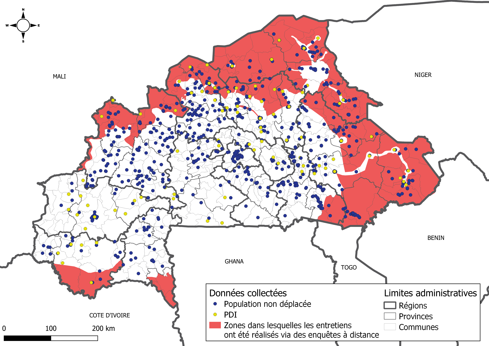

```{r}
# Time zone for windows
Sys.setenv(TZ = "Africa/Abidjan")
Sys.setenv(LANGUAGE = "en")

```

```{r, include = F}
# Many things to be improved:
# 1- clean up unnecessary things, code, packages, etc.
# 2- add utils and dashboard_f to package ImpactR, rationalize
# 3- try to move from leaflet to tmap, easier to read, need to tackle 
# the issue of legend format
```


```{r setup, include=FALSE}
library(knitr)
library(tidyverse)
library(janitor)
library(dplyr)
library(magrittr)
library(htmltools)
library(flexdashboard)
library(sf)
library(leaflet)
library(DT)
library(shiny)
library(stringr)
library(tidyr)
library(scales)
library(formattable)

knitr::opts_chunk$set(warning = FALSE, error = F, message = F)
```

```{r, include = F}
DT::datatable(data.frame(x = 1))
```


```{r}
options(
  box.path = here::here(),
  encoding = "UTF-8"
)

box::use(
  readxl,
  readr,
  magrittr[`%>%`],
  data.table,
  data.table[`:=`],
  here[here],
  stringr,
  # Own library
  uti = lib / utils,
  dash = lib / dashboard_f
)

options(ztable.type = "html")
```

```{r, include = F}

# To correct mising or zeros 
rep_ad2 <- uti$csv_import("data/bfa_msna_21_hrp_admin2_names.csv")
vec_region_na_pdi <- c("Centre-Sud", "Sud-Ouest", "Centre")


# Read simple RDS
file_paths <- fs::dir_ls("data/Robj/", regexp = "simple_(.*).RDS")

simple <- file_paths |> 
  purrr::map(~ readr::read_rds(.x)) |> 
  dplyr::bind_rows() |> 
  dplyr::arrange(rq, sub_rq)


# Read complex RDS
file_paths <- fs::dir_ls("data/Robj/", regexp = "complex_(.*).RDS")

complex <- file_paths |> 
  purrr::map(~ readr::read_rds(.x)) |> 
  dplyr::bind_rows() |> 
  dplyr::arrange(rq, sub_rq)


# Bind both dataframes
simple <-  dplyr::bind_rows(simple, complex)


# For further use
simple$label_choices[is.na(simple$label_choices)] <- ""


# Mutate some
simple <- simple |> 
  dplyr::mutate(
    level_name = dplyr::if_else(level_name == "HRP - Province", "Province", level_name),
    group_pop_name = dplyr::if_else(group_pop_name == "Menages non deplaces", "Ménages non déplacés", group_pop_name)
  ) |> 
  dplyr::group_by(id_analysis, name_choices, level, group_pop_name) |> 
  dplyr::filter(!all(stat_num <= 0.01)) |> 
  dplyr::ungroup()

# Sub-dt for faster inputs
inputs <- simple %>%
  dplyr::select(level_name, rq, indicator, label_choices, group_pop_name)

```


```{r, echo = F}

# Colors
white <- "#FFFFFF"
black <- "#00000"

reach_grey <- "#58585A"
reach_lt_grey <- "#C6C6C6"
reach_lt_grey2 <- "#818183"
reach_lt_grey3 <- "#E3E3E3"
reach_dk_grey <- "#464647"


reach_red <- "#EE5859"
reach_orpink <- "#f8aa9b"
reach_pink <- "#f5a6a7"
reach_lt_pink <- "#F9C6C7"
reach_hot_pink <- "#ef6d6f"

reach_mddk_red <- "#bf4749"
reach_dk_red <- "#782c2e"

reach_beige <- "#D2CBB8"
reach_orange <- "#F69E61"

reach_lt_green <- "#B0CFAC"
reach_green <- "#84A181"
reach_drk_green <- "#526450"

reach_red_palette <- c(reach_pink, reach_red, reach_mddk_red)
reach_green_palette <- c(reach_lt_green, reach_green, reach_drk_green)
reach_grey_palette <- c(reach_lt_grey, reach_lt_grey2, reach_dk_grey)
```

  
Présentation
===

Column {.sidebar data-width=350}
-------------------------------------

### Introduction
Dans le cadre de l'Evaluation multisectorielle des besoins (MSNA) 2021, ce *dashboard* présente des résultats préliminaires basés sur la collecte de données qui s'est tenue du 14 juin au 23 juillet.

Cette enquête visait à évaluer les besoins multisectoriels des ménages déplacés et non déplacés dans toutes les régions du Burkina Faso.

### Contact 

Si vous souhaitez obtenir d'autres visualisations ou si vous avez un intérêt pour d'autres indicateurs, vous pouvez envoyer un courriel à : guillaume.noblet@reach-initiative.org ou margot.fortin@reach-initiative.org.


### Les onglets de résultats

Vous trouverez dans chaque onglet des données par tableau ou par carte correspondants aux différentes parties du questionnaire MSNA.

### 
```{r logo, echo = F,  out.width = '80%', fig.align="center"}

```


Column {data-width=450}
-------------------------------------


### Couverture statistique et géographique

2046 ménages déplacés et 2980 non déplacés ont participé à l'enquête dans les 13 régions.

L’ensemble des régions du pays ont été couvertes. Toutefois, des difficultés d’accès à la fois logistiques et sécuritaires ont entravé l’opérationnalisation des évaluations.

En collaboration avec différents partenaires humanitaires du pays, des zones accessibles 
à nos enquêteurs et enquêtrices ont donc été définies en amont pour la réalisation
des enquêtes en face-à-face.

Les données ont été collectées grâce à trois types d'entretien. Pour les zones difficiles d’accès,
les entretiens ont été réalisés (1) par téléphone ou encore (2) en personne, dans un lieu tiers sécuritaire à proximité. Pour les zones accessibles, les entretiens ont été réalisés (3) en face-à-face.   


### Echantillonnage

Deux types d'échantillonnage ont été utilisés :

- Echantillonnage aléatoire stratifié par grappes pour les ménages non déplacés

- Echantillonnage non probabiliste par quotas pour les ménages déplacés (PDI)

Les résultats sont présentés à titre indicatif.

Les données sont disponibles au niveau "Province" pour les régions du plan de réponse humanitaire et au niveau "Région" pour les autres.

- Niveau province : Boucle du Mouhon, Centre-Est, Centre-Nord, Est, Nord, Sahel, Comoé (ménages déplacés)

- Niveau région : Cascades, Centre, Centre-Ouest, Centre-Sud, Hauts-Bassins, Plateau-Central, Sud-Ouest


Column {data-width=550}
-------------------------------------

<!-- ### Nombre d'enquêtes PDI -->

<!-- ```{r, echo = F} -->
<!-- flexdashboard::valueBox("2046 ménages déplacés", -->
<!--                         caption = "ont été enquêtés", -->
<!--                         icon = "fa-file-text", -->
<!--                         color = reach_lt_grey2) -->
<!-- ``` -->

<!-- ### Nombre d'enquêtes non déplacés -->

<!-- ```{r, echo = F} -->
<!-- flexdashboard::valueBox("2980 ménages non déplacés", -->
<!--                         caption = "ont été enquêtés", -->
<!--                         icon = "fa-file-text", -->
<!--                         color = reach_lt_grey2) -->

<!-- ``` -->

### Carte de la couverture géographique par groupe de population

```{r communes, echo = F, out.width = '80%', fig.align="center"}

```


Tableau
===

## Info {.sidebar data-width=350}

### Sélection de l'indicateur

Sélectionner le niveau d'analyse (Province, Région, National, National - HRP). 

Sélectionner ensuite le secteur et l'indicateur.

Enfin, choisissez pour quel groupe de population vous souhaitez afficher la statistique.

```{r, echo = F}

# Side bar panel (descending)
shiny::sidebarPanel(
  shiny::selectInput("niveau",
    label = "Niveau",
    choices = unique(inputs$level_name)
  ),
  shiny::selectInput("rq",
    label = "Secteur",
    choices = (unique(inputs$rq))
  ),
  shiny::selectInput("indicator",
    label = "Indicateur",
    choices = unique(inputs$indicator)
  ),
  shiny::selectInput("group",
    label = "Groupe de population",
    choices = unique(inputs$group_pop_name)
  ),
  width = 12
)

# Observe events
shiny::observeEvent(input$niveau, {
  shiny::updateSelectInput(
    session,
    "rq",
    choices = unique(inputs %>%
      dplyr::filter(level_name == input$niveau) %>%
      dplyr::pull(rq))
  )
})

shiny::observeEvent(input$rq, {
  shiny::updateSelectInput(
    session,
    "indicator",
    choices = unique(inputs %>%
      dplyr::filter(level_name == input$niveau & rq == input$rq) %>%
      dplyr::pull(indicator))
  )
})

shiny::observeEvent(input$indicator, {
  shiny::updateSelectInput(
    session,
    "group",
    choices = unique(inputs %>%
      dplyr::filter(level_name == input$niveau & rq == input$rq & indicator == input$indicator) %>%
      dplyr::pull(group_pop_name))
  )
})
```


### 
```{r logo_tab, echo = F,  out.width = '80%', fig.align="center"}

```


## Table {data-orientation=rows data-navmenu="Tableau récapitulatif"}

### Tableau récapitulatif par indicateur


```{r, echo = F}
div(
  DT::renderDataTable(
  {
  dt <- simple |>
      dplyr::filter(level_name == input$niveau) %>%
      dplyr::filter(rq == input$rq) %>%
      dplyr::filter(indicator == input$indicator) %>%
      dplyr::filter(group_pop_name == input$group) %>%
    dash$pivot_ana(input$niveau) %>%
    # dplyr::select(where(~ !all(as.character(.x) == ""))) %>%   # .[colSums(!is.na(x)) > 0]
    janitor::remove_empty(which = "cols") %>%
    as.data.frame() %>%
    # dplyr::mutate(dplyr::across(.cols = everything(), function(x){ifelse(x == "", NA_character_, x)})) |>
    formattable::formattable(list(formattable::area(col =  which(!(names(dt) %in% c("Sous-secteur",
                                                                                    "Sous-ensemble",
                                                                                    "Type",
                                                                                    "Indicateur",
                                                                                    "Choix")))) ~
                                    formattable::color_tile("white","#EE5859")))
  
formattable::as.datatable(dt, 
                          escape = FALSE,
                          rownames = FALSE,
                          extensions = "Buttons",
                          options = list(
                            dom = "Brti",
                            searching = FALSE,
                            pageLength = 20,
                            buttons = list("copy", "csv", "excel"),
                            language = list(buttons = list(copy = "Copier la table",
                                                           csv = "Télécharger CSV",
                                                           excel = "Télécharger Excel")),
                            scrollX = "300px",
                            scrollY = "600px")) |> 
  DT::formatStyle(1:ncol(dt), backgroundColor = white)
   # return(dt)

  }),
style = "font-size:12px; font-family: 'Leelawadee UI';")

```


Carte
===


```{r, include = F}

# Import geo data
admin1_geo_simple <- sf::st_read("data/bfa_msna_21_admin1_simple_final.geojson")

admin2_geo_simple <- sf::st_read("data/bfa_msna_21_admin2_simple.geojson") %>%
  dplyr::mutate(admin2 = stringr::str_replace_all(ADM2_FR, "-", "_"))

admin1_geo_lines <- sf::st_cast(admin1_geo_simple, "MULTILINESTRING")
admin2_geo_lines <- sf::st_cast(admin2_geo_simple, "MULTILINESTRING")
# admin2_geo_lines <- sf::st_cast(admin2_geo_simple, "LINESTRING")

# Couleurs reach
reach_palette <- uti$csv_import("data/bfa_msna_21_reach_colors.csv")
# reach_palette_rouge_5 <- rev(reach_palette$reach_red_5_hex)
# reach_palette_rouge_5 <- reach_palette_rouge_5[reach_palette_rouge_5 != ""]

reach_palette_iroise_5 <- reach_palette$reach_iroise_5_hex
reach_palette_iroise_5 <- reach_palette_iroise_5[!is.na(reach_palette_iroise_5)]

# Add white halo to admin labels
admin1_labels <- sf::st_read("data/centroid_admin1.geojson")
admin1_labels_halo <- sprintf(
  '<strong><span style="font-size: 12px; color: %s">%s</span></strong>',
  reach_grey, admin1_labels$ADM1_FR
) %>%
  lapply(htmltools::HTML)

admin2_labels <- sf::st_centroid(admin2_geo_simple)
admin2_labels_halo <- sprintf(
  '<strong><span style="font-size: 12px; color: %s">%s</span></strong>',
  reach_grey, admin2_geo_simple$ADM2_FR_propre
) %>%
  lapply(htmltools::HTML)

# Bounding box
bbox <- sf::st_bbox(admin2_geo_simple) %>%
  as.vector()

bbox[1] <- bbox[1] - 0.8
bbox[3] <- bbox[3] + 0.2

bbox[2] <- bbox[2] - 0.2
bbox[4] <- bbox[4] + 0.2
```


## Info {.sidebar data-width=350}

### Sélection de l'indicateur

Sélectionner le niveau d'analyse (Province ou Région). 

Sélectionner ensuite le secteur et l'indicateur, puis le choix si nécessaire.

Enfin, choisissez pour quel groupe de population vous souhaitez afficher la statistique.


```{r, echo = F}
# Sidebar panel (descending)
shiny::sidebarPanel(
  shiny::selectInput("map_niveau",
    label = "Niveau",
    choices = c("Region", "Province")
  ),
  shiny::selectInput("map_rq",
    label = "Secteur",
    choices = unique(inputs$rq)
  ),
  shiny::selectInput("map_indicator",
    label = "Indicateur",
    choices = unique(inputs$indicator)
  ),
  shiny::selectInput("map_choices",
    label = "Choix",
    choices = unique(inputs$label_choices)
  ),
  shiny::selectInput("map_group",
    label = "Groupe de population",
    choices = unique(inputs$group_pop_name)
  ),

  width = 12
)


# Observe events
shiny::observeEvent(input$map_niveau, {
  shiny::updateSelectInput(session,
    "map_rq",
    choices = unique(inputs %>%
      dplyr::filter(level_name == input$map_niveau) %>%
      dplyr::pull(rq))
  )
})

shiny::observeEvent(input$map_rq, {
  shiny::updateSelectInput(session,
    "map_indicator",
    choices = unique(inputs %>%
      dplyr::filter(level_name == input$map_niveau & rq == input$map_rq) %>%
      dplyr::pull(indicator))
  )
})

shiny::observeEvent(input$map_indicator, {
  shiny::updateSelectInput(session,
    "map_choices",
    choices = unique(inputs %>%
      dplyr::filter(level_name == input$map_niveau & rq == input$map_rq & indicator == input$map_indicator) %>%
      dplyr::pull(label_choices))
  )
})

shiny::observeEvent(input$map_choices, {
  shiny::updateSelectInput(session,
    "map_group",
    choices = unique(inputs %>%
      dplyr::filter(level_name == input$map_niveau & rq == input$map_rq & indicator == input$map_indicator & label_choices == input$map_choices) %>%
      dplyr::pull(group_pop_name))
  )
})
    
```


### 
```{r logo_map, echo = F, out.width = '80%', fig.align="center"}

```


## Carte par indicateur et par choix de réponse
### Carte par indicateur et par choix de réponse

```{r, echo = F}

# Label function modified to have clear cuts 21-30 / 31-40
# Does not work when values are below 1
# Tackled by removing them above
label_format <- function (prefix = "", suffix = "", between = " &ndash; ", digits = 3, 
  big.mark = ",", transform = identity) 
{
  formatNum <- function(x) {
    format(round(transform(x), digits), trim = TRUE, scientific = FALSE, 
      big.mark = big.mark)
  }
  function(type, ...) {
    switch(type, numeric = (function(cuts) {
      paste0(prefix, formatNum(cuts), suffix)
    })(...), bin = (function(cuts) {
      n <- length(cuts)
      paste0(prefix, formatNum(cuts[-n] + 1), between, formatNum(cuts[-1]), 
        suffix)
    })(...), quantile = (function(cuts, p) {
      n <- length(cuts)
      p <- paste0(round(p * 100), "%")
      cuts <- paste0(formatNum(cuts[-n] + 1), between, formatNum(cuts[-1]))
      paste0("<span title=\"", cuts, "\">", prefix, p[-n], 
        between, p[-1], suffix, "</span>")
    })(...), factor = (function(cuts) {
      paste0(prefix, as.character(transform(cuts)), suffix)
    })(...))
  }
}
```


```{r, echo = F}
# To suppress some error that shows up while updating colorNumeric or colorBin
tags$style(
  type = "text/css",
  ".shiny-output-error { visibility: hidden; }",
  ".shiny-output-error:before { visibility: hidden; }"
)

# Leaflet map
leaflet_map <- shiny::reactive({
  if (input$map_niveau == "Region") {
    to_map_admin1 <- simple |> 
      dplyr::filter(level_name == input$map_niveau & rq == input$map_rq & indicator == input$map_indicator & label_choices == input$map_choices & group_pop_name == input$map_group)
    
    uq_type <- unique(to_map_admin1$type)[1]
  
    to_map_admin1 <- admin1_geo_simple |> 
      dplyr::left_join(to_map_admin1, by = "admin1") |> 
      dplyr::mutate(
        indicator = input$map_indicator,
        label_choices = input$map_choices,
        group_pop_name = input$map_group,
        type = uq_type
      ) |> 
      dplyr::mutate(stat_num = ifelse(group_pop_name != "PDI" & !(admin1_name %in% vec_region_na_pdi), 
                                      tidyr::replace_na(stat_num, replace = 0),
                                      stat_num
                                      )) |> 
      dplyr::mutate(stat_to_map = ifelse(stringr::str_detect(type, "Pourcentage"), round(stat_num * 100, 0), stat_num))


    fillcol_5 <- leaflet::colorBin(reach_palette_iroise_5,
      domain = to_map_admin1$stat_to_map,
      bins = 5,
      na.color = white,
      right = T
    )
    fillcol_5_legend <- leaflet::colorBin(reach_palette_iroise_5,
      domain = to_map_admin1$stat_to_map,
      bins = 5,
      na.color = rgb(0, 0, 0, 0),
      right = T
    )

    label_admin1 <- sprintf(
      '<strong><span style="font-size: 16px; color: %s;"> %s </span><br>
      <span style="font-size: 13px; color: %s;"> %s </span><br>
      <span style="font-size: 13px; color: %s;"> %s </span><br>
      <span style="font-size: 12px; color: %s;"> %s </span><br>
      <span style="font-size: %s; color: %s;"> %s </span></strong>',
      reach_dk_grey,
      to_map_admin1$ADM1_FR,
      reach_grey,
      paste0("Indicateur : ", to_map_admin1$indicator),
      reach_grey,
      ifelse(is.na(to_map_admin1$label_choices), "", paste0("Choix : ", to_map_admin1$label_choices)),
      reach_lt_grey,
      ifelse(is.na(to_map_admin1$stat_num),
        "",
        ifelse(is.na(to_map_admin1$subset) & to_map_admin1$stat_num == 0,
               "Aucune réponse",
               ifelse(
                 is.na(to_map_admin1$subset),
                 "Calculé sur l'ensemble des ménages",
                 paste0("Sous-ensemble : ", to_map_admin1$subset)
               )
        )
      ),
      "16px",
      reach_dk_grey,
      ifelse(is.na(to_map_admin1$stat_num), 
             "Pas d'enquêtes",
             ifelse(
               grepl("Pourcentage", to_map_admin1$type),
                 paste(to_map_admin1$stat_to_map, "%"),
               round(to_map_admin1$stat_num, 1)
               )
      )
      
    ) %>% lapply(htmltools::HTML)

  leaflet::leaflet(options = leafletOptions(
      scrollWheelZoom = T,
      zoomControl = T,
      doubleClickZoom = F,
      zoomSnap = 0.1,
      zoomDelta = 0.1,
      dragging = T,
      attributionControl = F,
      easeLinearity = 0.35, # maxZoom = 7.2, minZoom = 7.2
    )) %>%
      leaflet::addPolygons(
        data = to_map_admin1,
        color = white,
        fillColor = ~ fillcol_5(stat_to_map),
        label = label_admin1,
        smoothFactor = 0.5,
        opacity = 0,
        fillOpacity = 1,
        options = list(zIndex = 450),
        highlightOptions = highlightOptions(
          fillColor = reach_lt_grey,
          color = reach_lt_grey,
          weight = 0,
          opacity = 0,
          fillOpacity = 1,
          bringToFront = F
        ),
        labelOptions = labelOptions(
          noHide = F,
          opacity = 0.9,
          direction = "auto",
          offset = c(-10, 0),
          textOnly = F,
          style = list(
            # "border" = sprintf("2px solid %s", reach_red),
            "padding" = "3px 8px",
            "font-family" = "Leelawadee UI"
          )
        )
      ) %>%
      leaflet::addProviderTiles(providers$CartoDB.PositronNoLabels,
        options = providerTileOptions(opacity = 0.6)
      ) %>%
      leaflet::addPolylines(
        data = admin1_geo_lines,
        color = reach_grey,
        weight = 1.3,
        opacity = 1.0,
        options = list(zIndex = 400)
      ) %>%
      leaflet::addLabelOnlyMarkers(
        data = admin1_labels,
        label = admin1_labels_halo,
        labelOptions = labelOptions(
          noHide = T,
          direction = "center",
          textOnly = T,
          style = list(
            "padding"     = "3px 8px",
            "font-family" = "Leelawadee UI",
            "text-shadow" = sprintf("-0.8px 0 %s, 0 0.8px %s, 0.8px 0 %s, 0 -0.8px %s, 0 0 7px %s", white, white, white, white, white)
          )
        )
      ) %>%
      # set view coordinates
      leaflet::fitBounds(bbox[1], bbox[2], bbox[3], bbox[4]) %>%
      # add gradient legend
      leaflet::addLegend(
        position = "topright",
        opacity = 1,
        pal = fillcol_5_legend,
        values = to_map_admin1$stat_to_map,
        na.label = "",
        labFormat = label_format(),
        title = unique(to_map_admin1$type)
      ) %>%
      # add scale
      leaflet::addScaleBar(position = "bottomleft", scaleBarOptions(imperial = FALSE)) # %>%
    
  } else if (input$map_niveau == "Province") {
    to_map_admin2 <- simple %>%
      dplyr::filter(level_name == input$map_niveau & rq == input$map_rq & indicator == input$map_indicator & label_choices == input$map_choices & group_pop_name == input$map_group)
    
    uq_type <- unique(to_map_admin2$type)[1]


    to_map_admin2 <- admin2_geo_simple %>%
      dplyr::left_join(to_map_admin2, by = "admin2") %>%
      dplyr::mutate(
        indicator = input$map_indicator,
        label_choices = input$map_choices,
        group_pop_name = input$map_group,
        type = uq_type) |> 
      dplyr::mutate(
        stat_num = ifelse(group_pop_name == "PDI" & ADM2_FR_propre %in% rep_ad2[repres_ad2 == "pdi", admin2_name],
                          tidyr::replace_na(stat_num, replace = 0),
                          ifelse(
                            group_pop_name != "PDI" & ADM2_FR_propre %in% rep_ad2[repres_ad2 == "hote", admin2_name],
                            tidyr::replace_na(stat_num, replace = 0),
                            ifelse(
                              ADM2_FR_propre  %in% rep_ad2[repres_ad2 == "ens", admin2_name],
                              tidyr::replace_na(stat_num, replace = 0),
                              stat_num)))) |>
      dplyr::mutate(stat_to_map = ifelse(stringr::str_detect(type, "Pourcentage"), round(stat_num * 100, 0), stat_num))


    fillcol_5 <- leaflet::colorBin(reach_palette_iroise_5,
      domain = to_map_admin2$stat_to_map,
      bins = 5,
      na.color = white,
      right = T
    )
    
    fillcol_5_legend <- leaflet::colorBin(reach_palette_iroise_5,
      domain = to_map_admin2$stat_to_map,
      bins = 5,
      na.color = rgb(0, 0, 0, 0),
      right = T
    )
    
    

    label_admin2 <- sprintf(
      '<strong><span style="font-size: 16px; color: %s;"> %s </span><br>
      <span style="font-size: 13px; color: %s;"> %s </span><br>
      <span style="font-size: 13px; color: %s;"> %s </span><br>
      <span style="font-size: 12px; color: %s;"> %s </span><br>
      <span style="font-size: %s; color: %s;"> %s </span></strong>',
      reach_dk_grey,
      to_map_admin2$ADM2_FR_propre,
      reach_grey,
      paste("Indicateur : ", to_map_admin2$indicator),
      reach_grey,
      ifelse(to_map_admin2$label_choices == "", "", paste0("Choix : ", to_map_admin2$label_choices)),
      reach_lt_grey,
      ifelse(is.na(to_map_admin2$stat_num),
        "",
        ifelse(is.na(to_map_admin2$subset) & to_map_admin2$stat_num == 0,
               "Aucune réponse",
               ifelse(
                 is.na(to_map_admin2$subset),
                 "Calculé sur l'ensemble des ménages",
                 paste0("Sous-ensemble : ", to_map_admin2$subset)
               )
        )
      ),
      "16px",
      reach_dk_grey,
      ifelse(is.na(to_map_admin2$stat_num), 
             "Pas d'enquêtes",
             ifelse(
               grepl("Pourcentage", to_map_admin2$type),
               paste(round(to_map_admin2$stat_num *100, 0), "%"),
               round(to_map_admin2$stat_num, 1)
               )
             )
      ) %>% lapply(htmltools::HTML)

    
    leaflet::leaflet(options = leafletOptions(
      scrollWheelZoom = T,
      zoomControl = T,
      doubleClickZoom = F,
      zoomSnap = 0.1,
      zoomDelta = 0.1,
      dragging = T,
      attributionControl = F,
      easeLinearity = 0.35, #maxZoom = 7.2, minZoom = 7.2
    )) %>%
      leaflet::addPolygons(
        data = to_map_admin2,
        color = white,
        fillColor = ~ fillcol_5(stat_to_map),
        label = label_admin2,
        smoothFactor = 0.5,
        opacity = 0,
        fillOpacity = 1,
        options = list(zIndex = 450),
        highlightOptions = highlightOptions(
          fillColor = reach_lt_grey,
          color = reach_lt_grey,
          weight = 0,
          opacity = 0,
          fillOpacity = 1,
          bringToFront = F
        ),
        labelOptions = labelOptions(
          noHide = F,
          opacity = 0.9,
          direction = "auto",
          offset = c(-10, 0),
          textOnly = F,
          style = list(
            "padding" = "3px 8px",
            "font-family" = "Leelawadee UI"
          )
        )
      ) %>%
      leaflet::addProviderTiles(providers$CartoDB.PositronNoLabels,
        options = providerTileOptions(opacity = 0.6)
      ) %>%
      leaflet::addPolylines(
        data = admin2_geo_lines,
        color = reach_grey,
        weight = 0.8,
        opacity = 1.0,
        options = list(zIndex = 400)
      ) %>%
      leaflet::addPolylines(
        data = admin1_geo_lines,
        color = reach_dk_grey,
        weight = 1.3,
        opacity = 1.0,
        options = list(zIndex = 400)
      ) %>%
      leaflet::addLabelOnlyMarkers(
        data = admin2_labels,
        label = admin2_labels_halo,
        labelOptions = labelOptions(
          noHide = T,
          direction = "center",
          textOnly = T,
          style = list(
            "padding"     = "3px 8px",
            "font-family" = "Leelawadee UI",
            "text-shadow" = sprintf("-0.8px 0 %s, 0 0.8px %s, 0.8px 0 %s, 0 -0.8px %s, 0 0 7px %s", white, white, white, white, white)
          )
        )
      ) %>%
      # set view coordinates
      leaflet::fitBounds(bbox[1], bbox[2], bbox[3], bbox[4]) %>%
      # add gradient legend
      leaflet::addLegend(
        position = "topright",
        opacity = 1,
        pal = fillcol_5_legend,
        values = to_map_admin2$stat_to_map,
        na.label = "",
        labFormat = label_format(),
        title = unique(to_map_admin2$type)[1]
      ) %>%
      # add scale
      leaflet::addScaleBar(position = "bottomleft", scaleBarOptions(imperial = FALSE))
  }
})


leaflet::renderLeaflet({
  leaflet_map()
})
